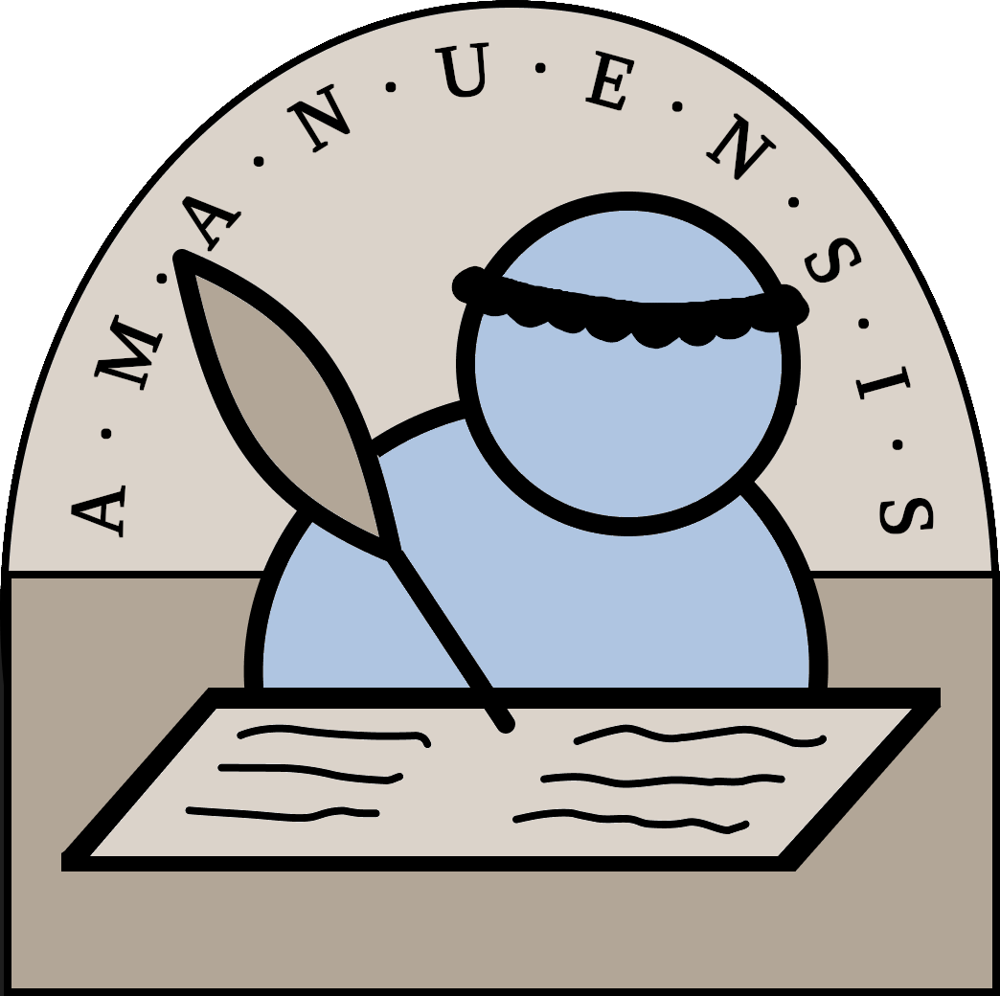

<p align="center">
  
</p>

<p align="center">
  <b>Editor de localización para traducir strings de Deltarune / Undertale.</b>
</p>

---

**amanuensis** é unha aplicación de escritorio (JavaFX) feita a medida para o
proxecto [DELTARUNE en galego](https://www.github.com/manu-pc/deltarune-en-galego).

Os ficheiros de texto do xogo veñen cheos de códigos de formato (cores, pausas,
saltos de liña, iconas...). Editalos á man é lento e fácil de romper. amanuensis
**oculta eses códigos**, deixa traducir texto limpo, e reinséreos na posición
correcta ao gardar.

Ademais, **sincroniza co repositorio en GitHub por ti**: baixar, subir e resolver
choques entre tradutores faise dende o programa de forma intuitiva sen ter que entender de git.

O propósito desta aplicación é traer a máis xente ao proxecto de tradución, facéndolles o traballo máis doado e aforrándolles ter que traballar a baixo nivel. 


## Documentación

1. **[O editor e os marcadores do xogo](docs/1-o-editor.md)** — como se traduce e que fai cos códigos de formato.
2. **[Sincronización con GitHub](docs/2-github.md)** — colaborar entre tradutores sen tocar `git`.

## Compilación

```bash
# Compilar e executar (Linux)
./run.sh

# Modo desenvolvemento (sen empaquetar)
./mvnw javafx:run

# Jar para Windows
./mvnw -Pwindows clean package
```

O jar é autocontido (inclúe JavaFX). O directorio `lang/` debe estar no mesmo
lugar que o jar ao executar.

**Requisitos:** Java 21+. Opcional: `hunspell` + dicionario galego para a
corrección ortográfica (`sudo apt install hunspell hunspell-gl`).
