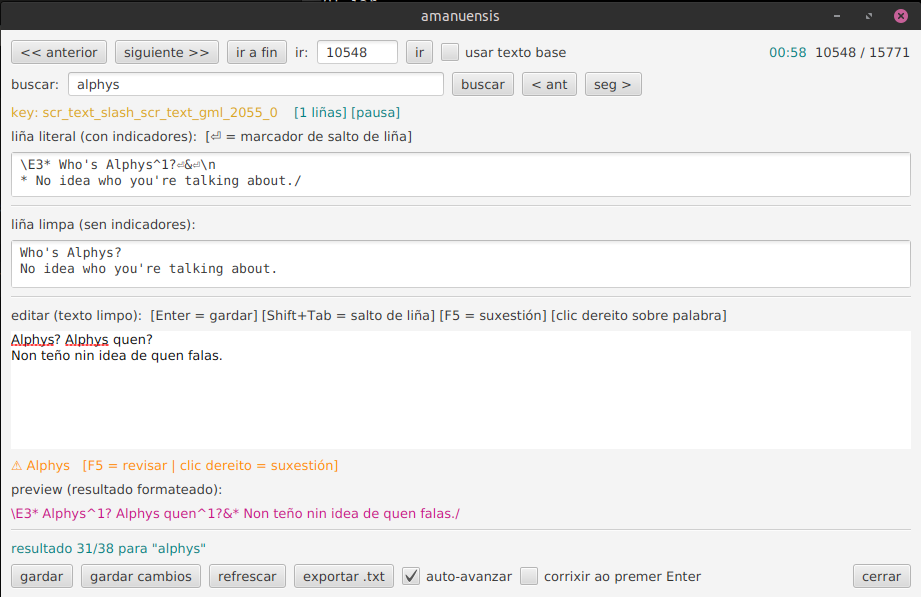

# amanuensis

Editor de localización para traducir os ficheiros de texto de Deltarune/Undertale. Deseñado para o proxecto [DELTARUNE en galego](github.com/manu-pc/deltarune-en-galego).



## Requisitos

- Java 21+
- (Opcional) `hunspell` co dicionario galego para corrección ortográfica en liña

```bash
# Debian/Ubuntu
sudo apt install hunspell hunspell-gl
```

## Compilar e executar

```bash
# Compilar e executar (Linux)
./run.sh

# Só executar en modo desenvolvemento (sen empaquetar)
./mvnw javafx:run

# Compilar jar para Windows
./mvnw -Pwindows clean package
# saída: target/amanuensis-windows-1.0-SNAPSHOT.jar
```

O jar é autocontido (inclúe JavaFX): `java -jar target/amanuensis-1.0-SNAPSHOT.jar`

O directorio `lang/` debe estar no mesmo lugar que o jar ao executar.

## Uso

Ao abrir, selecciona un `.json` de `lang/` (dobre clic) ou examina un ficheiro.

### Controis do editor

| Tecla | Acción |
|---|---|
| `AvPáx` / `RePáx` | Seguinte / anterior liña |
| `Ctrl+AvPáx` / `Ctrl+RePáx` | Saltar 10 liñas |
| `Enter` | Gardar e avanzar |
| `Shift+Tab` | Inserir salto de liña (`&`) |
| `F5` | Revisión ortográfica guiada (palabra a palabra) |
| `F3` / `Shift+F3` | Seguinte / anterior resultado de busca |

### Gardar

- **gardar** — aplica a tradución á copia de traballo (`.copy.json`)
- **gardar cambios** — escribe a copia de traballo no ficheiro orixinal

O editor traballa sempre sobre unha copia para protexer o orixinal.

## Marcadores do xogo

Os textos de Deltarune conteñen códigos de formato. O editor móstraos na páxina "liña literal" e ocúltalos na liña editable, onde se usan **marcadores de posición** que o usuario pode recolocar:

| Placeholder | Marcador orixinal | Efecto |
|---|---|---|
| `*texto*` | `\cX` / `\CX` | Cor de texto (os asteriscos delimitan o texto coloreado) |
| `~` | `~n` | Efecto de texto |
| `@` | `\On` | Obxecto |
| `$` | `\In` | Icona |

Os marcadores fixos (`\E`, `\M`, `* `, `( )`, pausas `^n`, saltos `&`) reinséirense automaticamente na posición correcta ao gardar.

**Convención para `^1`:** se o orixinal ten pausas `^1`, o editor elimínaas do texto limpo e reinséreas automaticamente antes de cada signo de puntuación (`,^1` `^1.` `..^1.`) na tradución ao gardar.

## Dicionario persoal

As palabras engadidas con «Engadir ao dicionario» gárdanse en `lang/amanuensis-personal.dic` e persisten entre sesións.
