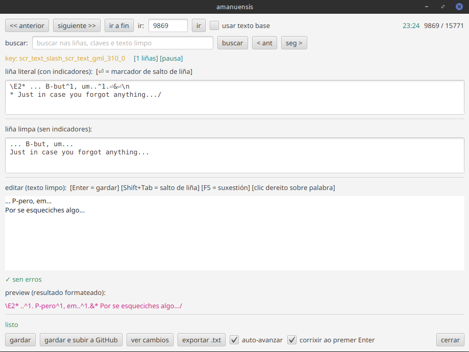

# O editor e os marcadores do xogo

[← Volver](../README.md)

Abres un ficheiro `strings` dun capítulo e traduces **liña a liña**. A pantalla
mostra tres vistas de referencia (o texto orixinal, a versión literal cos
códigos, e o texto limpo) e unha caixa editable onde escribes a tradución.

## Marcadores de formato

Os textos de Deltarune levan códigos de formato incrustados: cor (`\cX`), pausas
(`^1`), saltos de liña (`&`), iconas, efectos... amanuensis **quítaos do texto
que editas** e ponos de novo no seu sitio ao gardar.

Algúns marcadores si son recolocables (só teñen sentido rodeando palabras concretas), polo que se reemplazan con **placeholders** que ti colocas na túa tradución como quiras.

| Placeholder | Marcador orixinal | Efecto |
|---|---|---|
| `*texto*` | `\cX` / `\CX` | Cor de texto |
| `~` | `~n` | Efecto de texto |
| `@` | `\On` | Obxecto |
| `$` | `\In` | Icona |

Os fixos (`\E`, `\M`, `( )`, pausas `^1`, saltos `&`) reinséirense sós na
posición correcta. As pausas `^1` colócanse automaticamente antes de cada signo
de puntuación na tradución.

## Gardar

- **gardar** - aplica a tradución á copia de traballo (`.copy.json`).
- **gardar e subir a GitHub** - vólca a copia no orixinal e súbeo.

O editor traballa sempre sobre unha copia para protexer o orixinal. Cada liña
gárdase nela ao instante: non se perde nada aínda que peches sen subir.

## Atallos útiles

| Tecla | Acción |
|---|---|
| `AvPáx` / `RePáx` | Seguinte / anterior liña |
| `Enter` | Gardar e avanzar |
| `Shift+Tab` | Inserir salto de liña |
| `F5` | Revisión ortográfica guiada |
| `F3` / `Shift+F3` | Seguinte / anterior resultado de busca |

As palabras que engadas ao dicionario gárdanse en `lang/amanuensis-personal.dic`
e persisten entre sesións.
