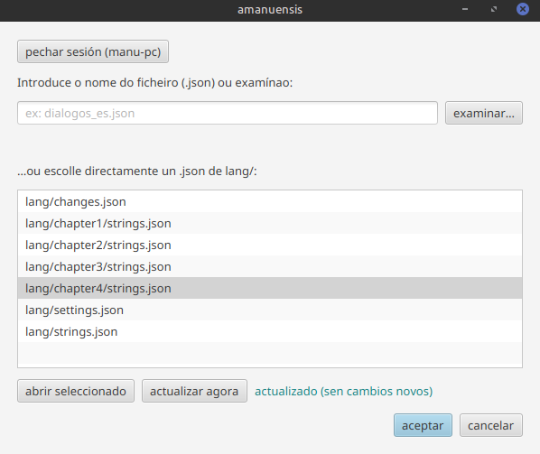
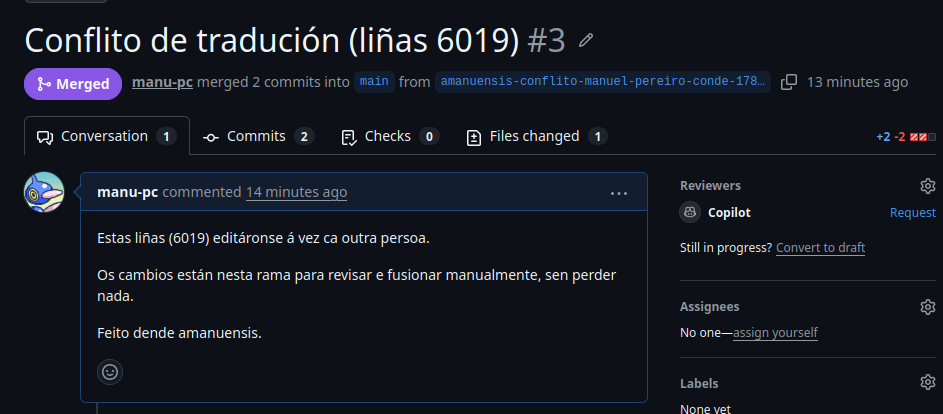

# Sincronización con GitHub

[← Volver](../README.md)

Varias persoas traducen o mesmo proxecto á vez. amanuensis encárgase de baixar,
subir e reconciliar o traballo **sen que teñas que saber usar `git`**.

## Login e descarga

Inicias sesión en GitHub desde a propia app (fluxo de dispositivo) e pulsas **descargar proxecto de tradución**. A partir
de aí a app trae os cambios dos demais soa, cada poucos minutos e cando abres o
editor.

## Subir cambios

Ao pulsar **«gardar e subir a GitHub»**, se alguén subiu cambios mentres
traducías, amanuensis **non fai un merge de texto** como `git` normal: como só se
editan valores de texto, compara **liña por liña**.

- Se non hai choque real → reaplica os teus cambios sobre a versión remota. Realízase un merge de forma seamless (como se di eso en galego?) sen que ningún dos editores teña que enterarse.
- Se dúas persoas tocaron a **mesma** liña → sube o teu traballo a unha rama
  aparte e **abre unha pull request** automaticamente, para revisar o choque con
  calma. O teu traballo nunca se perde.

Entón, en casos ideais, funciona como un documento compartido estándar tipo Drive onde varias persoas poden ir editando a súa parte sen enterarse do que fan os demais. E en casos límite, onde por un erro de organización dúas persoas editan a mesma liña á vez, pódese resolver o conflicto mediante a interfaz web de Github (bastante máis intuitivo que ter que empregar a terminal para alguén que non é informático).